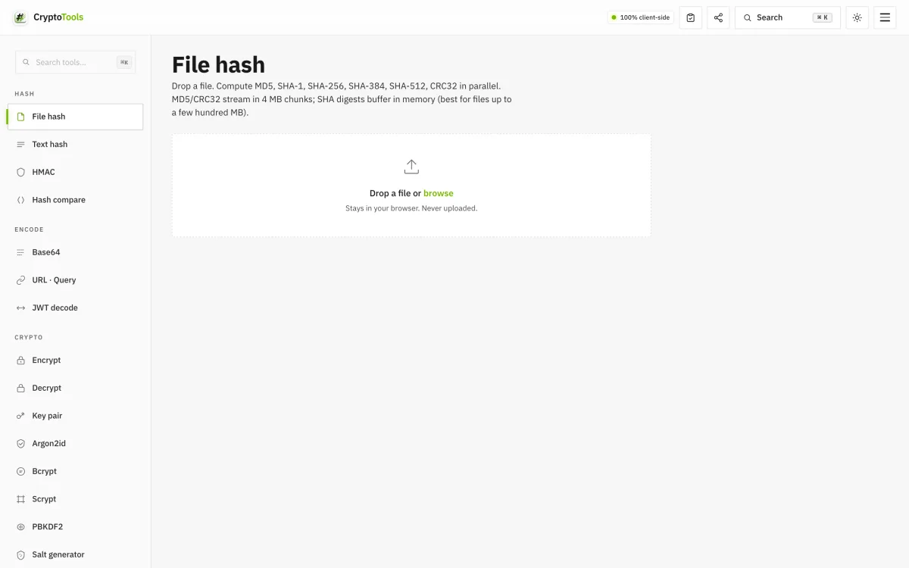

# Cryptools

> **Privacy-first developer tool suite — 42 tools that never leave your browser.**

**Live:** [cryptools-brown.vercel.app](https://cryptools-brown.vercel.app)

<p align="center">
  
</p>

A single-page web app for the things developers reach for daily: hashing, encryption, key generation, JWT/PASETO, post-quantum cryptography, AI-prompt security, and 30+ more.

Built for engineers who care about **what happens to their data** — every operation runs client-side via Web Crypto and audited libraries. No upload. No analytics. No backend. No tracking.

---

## Why

Most developer tool sites either upload your inputs to a backend, embed analytics, or both. When you're hashing real secrets, signing real tokens, or encrypting real files, that's not acceptable.

Cryptools is the alternative: every primitive runs in your tab via Web Crypto, WASM, or pure-JS audited libs. Close the tab — your data is gone.

---

## Capabilities

### Hashing
File hash (4 MB chunked stream, multi-GB supported) · Text hash (live) · HMAC · Hash compare (constant-time-ish)

Supports: **MD5, SHA-1, SHA-256, SHA-384, SHA-512, SHA3-256, SHA3-512, Keccak-256 (Ethereum), CRC32**

### Encryption
- **AES-256-GCM** password-based encrypt/decrypt (text + file) with PBKDF2 250 000 iter, optional **AAD** for context binding
- **Multi-recipient encrypt** (age-style) — wrap a DEK for N RSA-OAEP public keys
- **RAG vector encryption** — per-chunk HKDF + AES-GCM for client-encrypted embedding stores
- **AES-KW** (RFC 3394) — key wrapping for JWE A*KW patterns

### Key derivation
- **Argon2id** (RFC 9106) with optional pepper
- **Scrypt** (RFC 7914) — N up to 256 MiB
- **PBKDF2** (RFC 8018) — OWASP 2023+ defaults, PHC string output
- **HKDF** (RFC 5869) — derive subkeys
- **Bcrypt** with optional pepper

### Key pairs + signing
- **Ed25519** (RFC 8032) sign + verify
- **ECDSA** P-256 / P-384 / P-521
- **RSA-OAEP** + **RSA-PSS** 2048/3072/4096
- **ECDH** P-256 / P-384 / P-521
- PEM (SPKI + PKCS8) + JWK export

### Post-Quantum
- **ML-KEM-768** (FIPS 203, ex-Kyber) — key encapsulation
- **ML-DSA-65** (FIPS 204, ex-Dilithium) — signatures

### Tokens / 2FA
- **PASETO v4.public** (Ed25519) — modern JWT alternative
- **JWT** decode + HMAC verify
- **TOTP** (RFC 6238) — SHA-1/256/512, 6/7/8 digits, 15/30/60s period, with QR + live ±drift verify
- **Shamir Secret Sharing** (k-of-n, GF(256)) — Vault-grade

### Generators
- **Cryptographic tokens** w/ presets (Bearer / API key / Session / OTP / AES-256)
- **Passphrases** from BIP-39 wordlist (11 bits/word)
- **UUIDs** v1, v3, v4, v5, v6, v7, v8, NIL, MAX + ULID + NanoID + CUID2
- **Passwords** with entropy meter + pronounceable mode + HIBP k-anonymity check
- **QR codes** with presets — WiFi, vCard, SMS, email, geo, calendar
- **Salts** in 6 formats (hex/b64/b64url/bcrypt/argon2/raw)
- **Random data** — IPv4/IPv6/MAC/port/email/name/hex/GPS/credit card (Luhn-valid)/dice/coin/country

### Converters
- **JSON** format/minify/sort/validate
- **YAML ↔ JSON**
- **Chmod** interactive matrix
- **CIDR / IP** calculator (IPv4 + IPv6 with BigInt math)
- **Color** — hex/RGB/HSL/CMYK/LAB/LCH + palette harmonies + tints/shades + WCAG contrast (AA/AAA)
- **Cron** with cronstrue human-readable + 5 next runs + graphical builder
- **Number base** (bin/oct/dec/hex)
- **String case** (10 outputs incl. slug)
- **Date / Unix** with relative time
- **HTML entities** (named/numeric/hex)
- **Base64** / **URL & query** encode/decode

### AI security
- **Prompt Vault** — encrypted LLM prompt storage (AES-GCM + PBKDF2 250k)
- **Token counter** — estimate + USD cost across 10 LLMs (GPT-4o, Claude Opus 4, Gemini 2 Pro, Llama 3.1, etc)
- **AI-text detector** — flags Unicode-tag prompt-injection attacks (U+E0000-E007F), AI-cliche density, sentence-variance heuristics
- **Markdown scanner** — 20+ rules for XSS, prompt injection, IDN homoglyphs, hidden chars, ChatML tokens

### Developer tools
- **Regex tester** with 30-pattern library + cheatsheet
- **Text diff** with word-level intra-line highlighting

---

## What makes it different

| | Cryptools | Most online tool sites |
|---|---|---|
| Where your data goes | Stays in browser | Often POSTed to backend |
| Telemetry | None | Usually Google Analytics + more |
| Works offline | Yes (after first load) | No |
| Deep links | Every input syncs to URL | Rare |
| Keyboard | ⌘K palette + ⌘⏎ run | Usually none |
| Modern crypto | Post-quantum + Ed25519 + Argon2id + AAD | Often SHA-1 / MD5 only |

---

## Keyboard shortcuts

| Key | Action |
|---|---|
| `⌘K` / `Ctrl+K` | Open command palette (fuzzy tool search) |
| `⌘⏎` / `Ctrl+⏎` | Run active tool's primary action |
| `ESC` | Close palette |

---

## URL state

Every tool input syncs to the URL so any configuration is shareable:

```
?tool=token&length=66&charset=hex&count=3
?tool=color&c=10b981
?tool=cron&e=*/5+*+*+*+*
?tool=password&length=24&pron=1&live=1
```

---

## Tech

Vanilla HTML + CSS + JavaScript. No build step. No framework. Static-deployable anywhere.

Web Crypto API + CDN libs (spark-md5, crc-32, js-sha3, qrcode, cronstrue, bcryptjs, js-yaml, scrypt-js, argon2-browser WASM). Post-quantum primitives via `@noble/post-quantum` dynamic ESM import.

---

## License

All rights reserved. Source code is in a private repository. This public repo serves as the project landing page for the live app at [cryptools-brown.vercel.app](https://cryptools-brown.vercel.app).

---

Built by [@ArielShemesh1999](https://github.com/ArielShemesh1999). Design tokens derived from the Sculio editor (Lovable cream + Kraken precision, accent swapped to emerald).
