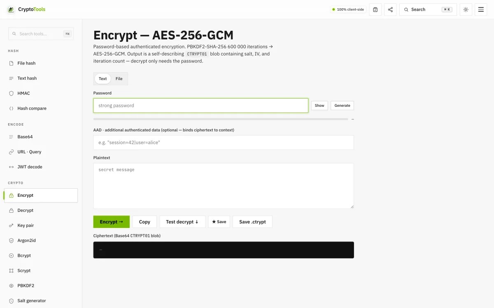
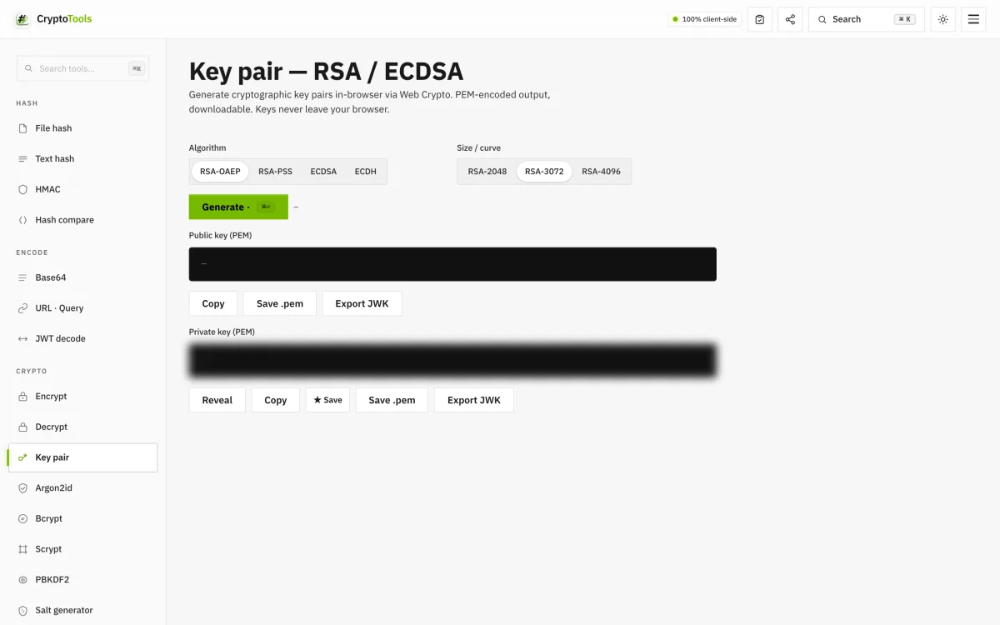
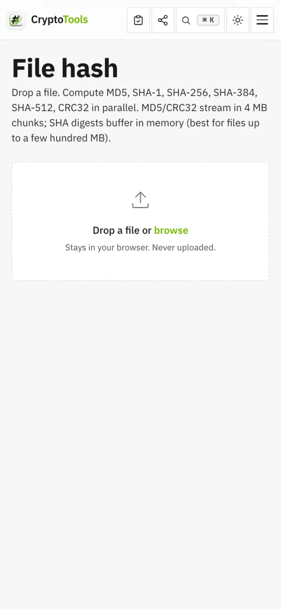

# Cryptools

> **Privacy-first developer tool suite — 42 tools that never leave your browser.**

**Live:** [cryptools-brown.vercel.app](https://cryptools-brown.vercel.app)

<p align="center">
  
</p>

A single-page web app for the things developers reach for daily: hashing, encryption, key generation, JWT/PASETO, post-quantum cryptography, web-security audits, encrypted prompt storage, and 30+ more.

Built for engineers who care about **what happens to their data** — every operation runs client-side via Web Crypto, WASM, or audited JS libraries. No upload. No analytics. No backend. No tracking.

---

## Why

Most developer tool sites either upload your inputs to a backend, embed analytics, or both. When you're hashing real secrets, signing real tokens, or encrypting real files, that's not acceptable.

Cryptools is the alternative: every primitive runs in your tab via Web Crypto, WASM, or pure-JS audited libs. Close the tab — your data is gone.

---

## Screenshots

| Encrypt — AES-256-GCM with PBKDF2 600 000 iterations | Key pair — RSA-OAEP / RSA-PSS / ECDSA / ECDH |
|---|---|
|  |  |

<p align="center">
  
</p>

---

## Capabilities

### Hashing
File hash (MD5/CRC32 streamed in 4 MB chunks, SHA digests buffered — best for files up to a few hundred MB) · Text hash (live; hex / base64 / base64url output) · HMAC · Hash compare (constant-time)

Supports: **MD5, SHA-1, SHA-256, SHA-384, SHA-512, SHA3-256, SHA3-512, Keccak-256 (Ethereum), CRC32**

### Encryption
- **AES-256-GCM** password-based encrypt/decrypt (text + file) with PBKDF2-SHA-256 600 000 iterations and optional **AAD** for context binding; output is a self-describing `CTRYPT01` blob (salt, IV, iteration count)
- **Multi-recipient encrypt** — wrap a fresh AES-256 DEK for N RSA-OAEP public keys
- **RAG vector encryption** — per-chunk AES-256-GCM keyed via HKDF, for client-encrypted embedding stores
- **AES-KW** (RFC 3394 / NIST SP 800-38F) — key wrapping for JWE A*KW patterns

### Key derivation
- **Argon2id** (RFC 9106, WASM) — OWASP 2023+ defaults (m=19 MiB, t=2, p=1), optional pepper
- **Scrypt** (RFC 7914) — N up to 2^18 (256 MiB)
- **PBKDF2** (RFC 8018) — 600 000-iteration SHA-256 default, PHC string output
- **HKDF** (RFC 5869) — derive subkeys
- **Bcrypt** with optional pepper
- **Salt generator** — 8–64 bytes as raw, hex, base64, base64url or bcrypt/scrypt/Argon2 PHC

### Key pairs + signing
- **Ed25519** (RFC 8032) sign + verify
- **RSA-OAEP** + **RSA-PSS** 2048/3072/4096 · **ECDSA** + **ECDH** P-256 / P-384 / P-521
- PEM (SPKI + PKCS8) + JWK export

### Post-Quantum
- **ML-KEM-768** (FIPS 203, ex-Kyber) — key encapsulation
- **ML-DSA-65** (FIPS 204, ex-Dilithium) — signatures

### Web security
- **CSP · Security headers** — paste a Content-Security-Policy or a raw response-header block; parsed, graded and audited for the usual footguns
- **X.509 · SSH keys** — decode a PEM certificate (subject, SAN, validity, fingerprints) or generate an Ed25519 SSH keypair in OpenSSH format
- **DNS · Email auth** — SPF, DMARC, DKIM, MX and CAA for a domain, fetched over DNS-over-HTTPS and audited client-side

### Tokens / 2FA
- **PASETO v4.public** (Ed25519) — modern JWT alternative
- **JWT** decode + HS256/384/512 sign and verify
- **TOTP** (RFC 6238) — SHA-1/256/512, 6/7/8 digits, 15/30/60 s period, QR export + live drift-tolerant verify
- **Shamir Secret Sharing** (k-of-n, GF(256))

### Generators
- **Tokens** with presets (Bearer / API key / Session / OTP / AES-256) plus NanoID, ULID, PKCE pair, JWT HS256 secret, AES-256-GCM key, CSRF state and `sk_live_`-style keys; live entropy meter
- **Passwords** — generator with entropy meter + pronounceable mode, strength analyser, HIBP k-anonymity check
- **Passphrases** from the 2048-word BIP-39 list (11 bits/word)
- **UUIDs** v1, v3, v4, v5, v6, v7, v8, NIL, MAX + ULID + NanoID + CUID2
- **QR codes** with presets — WiFi, vCard, SMS, email, geo, calendar
- **Random** — numbers in a range, bytes (hex / base64 / base64url), pick + shuffle — all from `crypto.getRandomValues`

### Converters
- **Data convert** — lossless JSON ↔ YAML ↔ TOML ↔ XML with auto-detect; pretty-print or minify
- **JSON → TypeScript / Zod / JSON Schema** from a pasted sample
- **Cron** — human-readable description (cronstrue) + next 5 runs + 8 presets
- **Timestamp / date** — Unix s/ms, ISO-8601, UTC, local and relative time, input auto-detected
- **Number base** (bin / oct / dec / hex + custom radix)
- **Case convert** — camel, Pascal, snake, kebab, CONSTANT, dot, path, Title, Sentence, lower, UPPER
- **Base64** (text + file) · **URL & query** encode/decode with query-string table
- **Network** — IPv4 subnet calculator, IPv6 expand/compress, MAC generator

### AI security
- **Prompt Vault** — encrypted LLM prompt storage in `localStorage` (AES-256-GCM + PBKDF2 600 000 iterations); ★ Save buttons stash tokens, ciphertexts and keys into the same vault
- **Markdown scanner** — 20+ rules for XSS, prompt injection, IDN homoglyphs, hidden characters, URL shorteners, base64 exfil blobs, ChatML tokens

### Developer tools
- **Regex tester** — live matching with highlighted results, group capture, replace preview
- **Text · JSON diff** — line diff; JSON mode normalizes key order and formatting so only real value changes show
- **Recipe pipeline** — chain operations CyberChef-style (encode/decode, hash, HTML entities, …) with drag-to-reorder

---

## What makes it different

| | Cryptools | Most online tool sites |
|---|---|---|
| Where your data goes | Stays in browser | Often POSTed to backend |
| Telemetry | None | Usually Google Analytics + more |
| Works offline | Yes (after first load) | No |
| Deep links | Every input syncs to URL | Rare |
| Keyboard | ⌘K palette + ⌘⏎ run | Usually none |
| Modern crypto | Post-quantum + Ed25519 + Argon2id + AAD | Often SHA-1 / MD5 only |

Two lookups leave the browser, and only when you trigger them: the DNS / email-auth check (DNS-over-HTTPS) and the HIBP password check (k-anonymity — only the first 5 SHA-1 hex characters are sent).

---

## Keyboard shortcuts

| Key | Action |
|---|---|
| `⌘K` / `Ctrl+K` | Open command palette (fuzzy tool search) |
| `⌘⏎` / `Ctrl+⏎` | Run active tool's primary action |
| `ESC` | Close palette |

---

## URL state

Every tool input syncs to the URL so any configuration is shareable:

```
?tool=token&length=66&charset=hex&count=3
?tool=uuid&v=v7&count=5
?tool=hmac&k=secret&m=hello
?tool=password&length=24&pron=1&live=1
```

---

## Tech

Vanilla HTML + CSS + JavaScript. No build step. No framework. Static-deployable anywhere; a service worker keeps the app usable offline after the first load.

Web Crypto API plus SRI-pinned libraries (spark-md5, crc-32, js-sha3, qrcode, cronstrue, bcryptjs, js-yaml, scrypt-js, smol-toml, argon2-browser WASM), each shipped as a same-origin vendored copy with jsdelivr as the alternate source. Post-quantum primitives via `@noble/post-quantum` dynamic ESM import.

Design: NVIDIA Volt — NVIDIA-green (`#76B900`) buttons and volt (`#CEFF00`) accents on true black, with a matching light theme.

---

## License

All rights reserved. Source code is in a private repository. This public repo serves as the project landing page for the live app at [cryptools-brown.vercel.app](https://cryptools-brown.vercel.app).

---

See also: [seal-provenance](https://github.com/shear559/seal-provenance) — the same author's paper and reference package on sealing digital files for verifiable provenance.

Source is private. Built by [@shear559](https://github.com/shear559).
